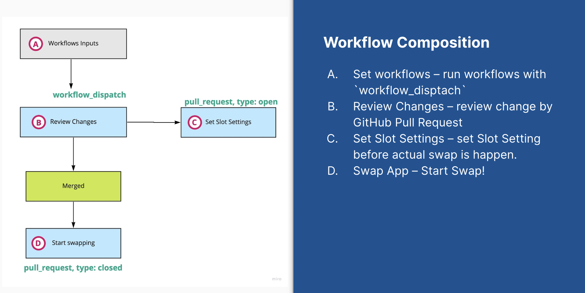

# Safely Swap Azure App Service Slot

[](https://github.com/mildronize/actions-az-webapp-swap/actions/workflows/test.yml)

Demo: https://www.youtube.com/watch?v=q5o6twX9gEg

<iframe src="https://docs.google.com/presentation/d/e/2PACX-1vRX0Nolf7gwGpPNme9cRJHKVxXt7FZ-njC85oNgTwS0gyQ39cCB6Hqm-rK3abNKuyxyO7wfI41YvdfM/embed?start=false&loop=false&delayms=3000" frameborder="0" width="960" height="569" allowfullscreen="true" mozallowfullscreen="true" webkitallowfullscreen="true"></iframe>

[Download Slide](https://docs.google.com/presentation/d/1vDox6HKISkUPyY_Jok39Dv9SHjrWa3CuJ9xLdaMXsUk/edit#slide=id.gc6f73a04f_0_0)

## Award

Participant in the top 10 final round of [Microsoft Virtual Hackathon 2022](https://www.hackerearth.com/challenges/hackathon/microsoft-virtual-hackathon-2022/) June 28, 2022, GitHub Actions Theme

## Features

- Prevent unwanted swap app settings between two slots
- Support multiple Azure App Services
  - Users can reviews changes all app services app settings before swap
  - Users can config which the app setting will be swapped or not. 
  - Automatically fix the app setting to be sticked with desired slot following config
- Leverage GitHub Features
  - GitHub Action Matrix for retryable steps
  - GitHub Pull Request review process for protecting unintentionally swap app service. 

This GitHub Actions is required to composition multiple GitHub Actions events for using full workflows as see figure:



## Example Usage 

Write a full workflows of using this Actions, it requires to using job and specific events for using this GitHub Actions. You can see the example below:

```yaml
name: Swap Slots
on:
  workflow_dispatch:
  pull_request:
    types: [opened, closed]
    branches:
      - appsettings
env:
  config_dir: ./.github/workflows/configs
jobs:
  get-matrix:
    runs-on: ubuntu-latest
    outputs:
      result: ${{ steps.get-matrix.outputs.deployment-matrix }}
    steps:
    - uses: actions/checkout@v3
    - name: Export deployment matrix
      id: get-matrix
      run: |
        node ./index.js test-get-deploy-slots.json
      working-directory: ${{ env.config_dir }}

  get-slot-settings:
    if: github.event_name == 'workflow_dispatch'
    runs-on: ubuntu-latest
    needs: [ get-matrix ]
    steps:
      - uses: actions/checkout@v2
      # SP: github action az webapp swap
      - uses: azure/login@v1
        with:
          creds: ${{ secrets.azure_credentials }}
      - uses: mildronize/actions-az-webapp-swap@v1
        with:
          mode: get-deploy-slots
          config: ${{ needs.get-matrix.outputs.result }}
          token: ${{ secrets.PAT }}
          repo: mildronize/actions-az-webapp-swap-demo
          
  set-slot-settings:
    if: >- 
      github.event_name == 'pull_request' &&
      github.event.action != 'closed'
    name: ${{ format('⚙️ Set Slot | {0} - {1}', matrix.name, matrix.slot) }}
    needs: [ get-matrix  ]
    runs-on: ubuntu-latest
    strategy:
      fail-fast: false
      matrix:
        include: ${{ fromJson(needs.get-matrix.outputs.result) }}
    steps:
      - uses: actions/checkout@v2
      # SP: github action az webapp swap
      - uses: azure/login@v1
        with:
          creds: ${{ secrets.azure_credentials }}
      
      - name: set-slot-settings
        uses: mildronize/actions-az-webapp-swap@v1
        with: 
          mode: set-deploy-slots
          swap-config: ${{ toJson(matrix) }}

  swap-slot:
    if: >- 
      github.event_name == 'pull_request' &&
      github.event.action == 'closed' && 
      github.event.pull_request.merged == true
    name: ${{ format('🚀 Swap Slot | {0} - {1}', matrix.name, matrix.slot) }}
    needs: [ get-matrix ]
    runs-on: ubuntu-latest
    strategy:
      fail-fast: false
      matrix:
        include: ${{ fromJson(needs.get-matrix.outputs.result) }}
    steps:
      - uses: actions/checkout@v2
      # SP: github action az webapp swap
      - uses: azure/login@v1
        with:
          creds: ${{ secrets.azure_credentials }}
      
      - name: set-slot-settings
        uses: mildronize/actions-az-webapp-swap@v1
        with: 
          mode: swap-slots
          swap-config: ${{ toJson(matrix) }}

  clean:
    name: Clean
    needs: [ swap-slot ]
    runs-on: ubuntu-latest
    steps:
      - uses: actions/checkout@v2
      - name: clean
        uses: mildronize/actions-az-webapp-swap@v1
        with: 
          mode: clean
          token: ${{ secrets.PAT }}
          repo: mildronize/actions-az-webapp-swap-demo

  close:
    if: >- 
      github.event_name == 'pull_request' &&
      github.event.action == 'closed' && 
      github.event.pull_request.merged == false
    name: close PR
    runs-on: ubuntu-latest
    steps:
      - uses: actions/checkout@v2
      - name: clean
        uses: mildronize/actions-az-webapp-swap@v1
        with: 
          mode: clean
          token: ${{ secrets.PAT }}
          repo: mildronize/actions-az-webapp-swap-demo
  
```

Write a JSON config file: 

```json
[
  {
    "name": "my-swap-app-test-01",
    "resourceGroup": "rg-swap-app-test",
    "slot": "staging",
    "targetSlot": "production",
    "defaultSlotSetting": "true",
    "defaultSensitive": "false",
    "appSettings": [
      {
        "name": "data1",
        "sensitive": false,
        "slotSetting": true
      },
      {
        "name": "data2",
        "sensitive": false,
        "slotSetting": true
      },
      {
        "name": "data3",
        "sensitive": true,
        "slotSetting": true
      }
    ],
    "connectionStrings": [
      {
        "name": "data4",
        "sensitive": true,
        "slotSetting": true
      }
    ]
  }
]
```


## Authors

- Thada Wangthammang ([@mildronize](https://github.com/mildronize))
- Sirinat Paphatsirinatthi ([@dmakeroam](https://github.com/dmakeroam))
- Piti Champeethong ([@ninefyi](https://github.com/ninefyi))

# Sponsorship

<p align="center">
  <a href="https://www.tt-ss.net/"></a>
  <a href="https://www.tt-ss.net/">T.T. Software Solution</a>
</p>

## TODO

- [ ] Mask sensitive in log